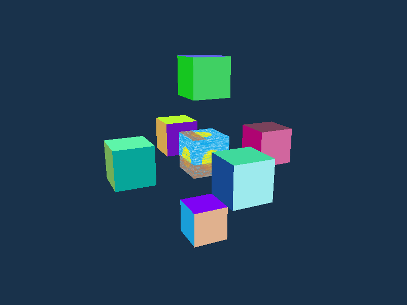
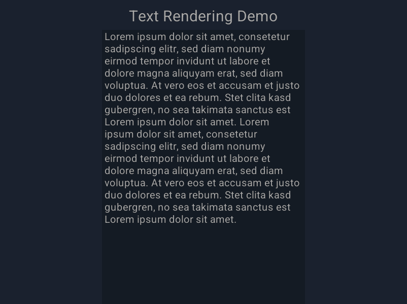
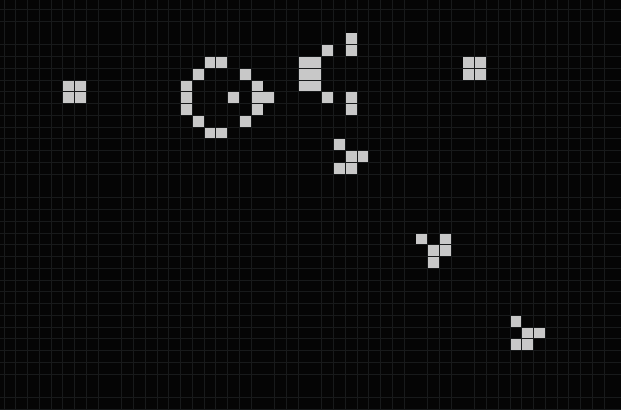

# RSML

[](https://github.com/Lewingston/rsml/actions/workflows/rust.yml)
[](https://github.com/Lewingston/rsml/actions/workflows/static.yml)

RSML is a simple 2d and 3d graphics library for rust. The implementation uses
[winit](https://github.com/rust-windowing/winit) and [wgpu](https://github.com/gfx-rs/wgpu).
The name and the concept is inspired by the C++ graphics library [SFML](https://github.com/sfml/sfml).

## Examples

Click the images to run the interactive examples in you web browser.

### [3D Scene](https://lewingston.github.io/rsml/scene_3d.html)
[](https://lewingston.github.io/rsml/scene_3d.html)

### [Text Rendering](https://lewingston.github.io/rsml/text_rendering.html)
[](https://lewingston.github.io/rsml/text_rendering.html)

### [Game of Life](https://lewingston.github.io/rsml/game_of_life.html)
[](https://lewingston.github.io/rsml/game_of_life.html)

## Building for Web

Install [wasm-bindgen](https://github.com/wasm-bindgen/wasm-bindgen):

```
cargo install wasm-bindgen-cli
```

Build one of the examples:

```
cargo build --example game_of_life --target wasm32-unknown-unknown
```

Create JavaScript bindings:

```
wasm-bindgen \
    target/wasm32-unknown-unknown/debug/examples/game_of_life.wasm \
    --out-dir pkg \
    --target web
```

Run the server application:

```
node test.js
```

Open the web page in the browser:

```
localhost:3000/test.html
```
